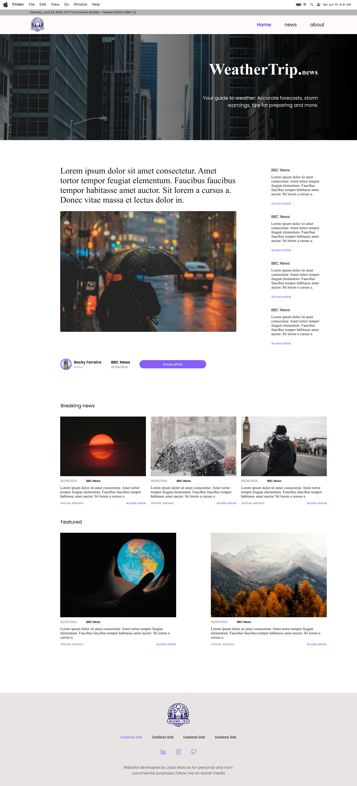

# 🌦️ WeatherApp

This is a project built with **HTML**, **CSS**, **JavaScript**, and **Tailwind CSS v4.1.5**.  

## Description
This project was created as a learning exercise to explore and understand how to work with **Tailwind CSS**.

### This is the final view


---
## Author
**Andrés M**
- [a.mendez.g@cofana-labs.com](a.mendez.g@cofana-labs.com)

## ✨ Features

- ⚡ Built with [Tailwind CSS 4.1.5](https://tailwindcss.com)
- 🎨 Responsive layout
- 💻 Developed using [Visual Studio Code](https://code.visualstudio.com/)
- 📁 Organized project structure

---

## 📁 Project Structure

```bash

tailwind/
├── assets/             # Static assets (images, icons, etc.)
│   ├── fonts/      
│   └── images/        
├── scripts/            # Optional JS files
├── styles/             
├── .gitignore            
├── tailwind.config.js  # Tailwind CSS configuration
├── package-lock.json   # PostCSS configuration
└── package.json

```
